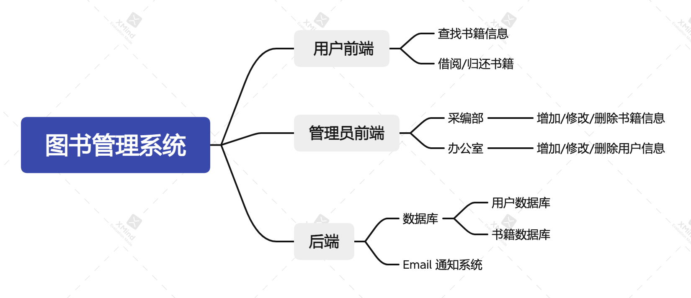
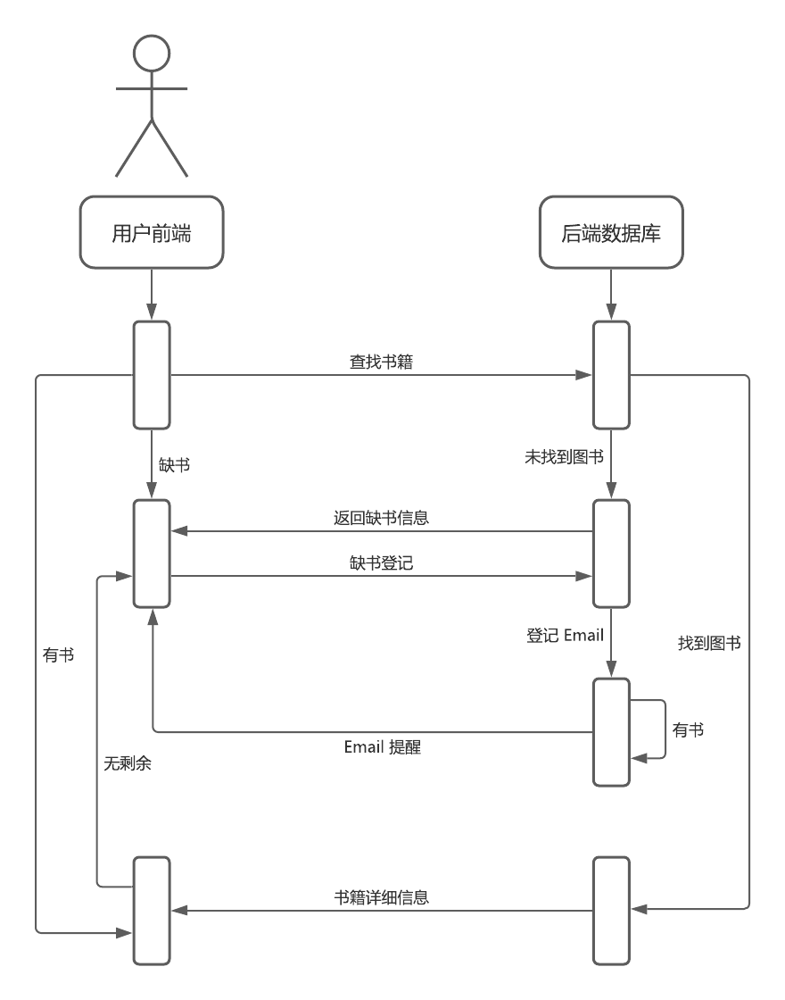
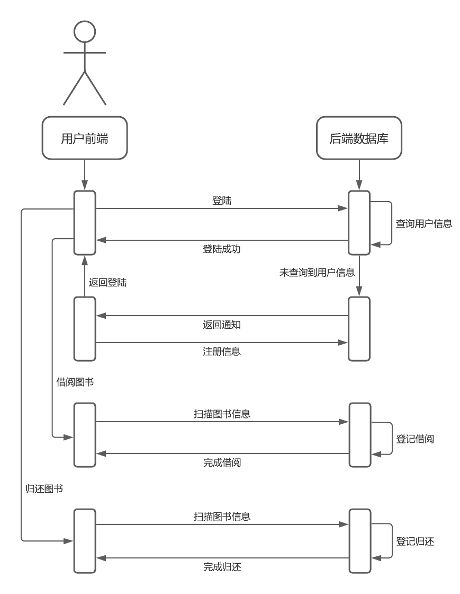
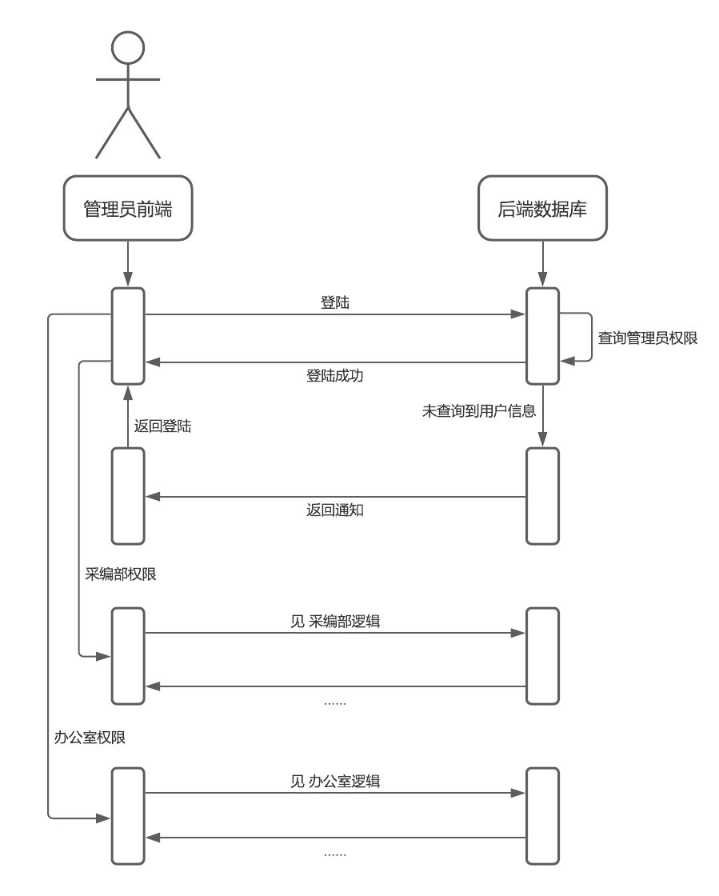
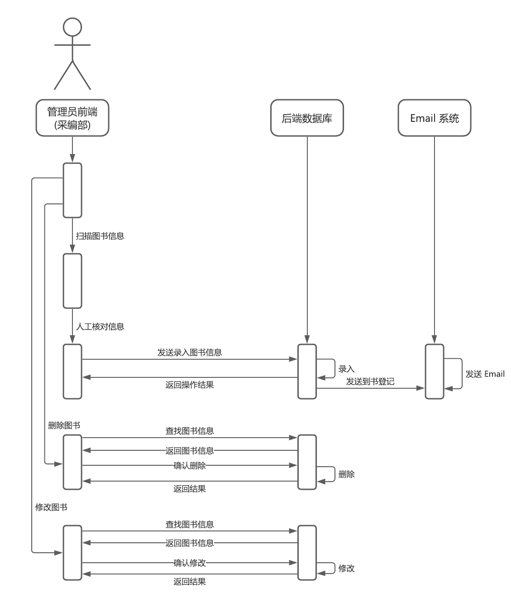
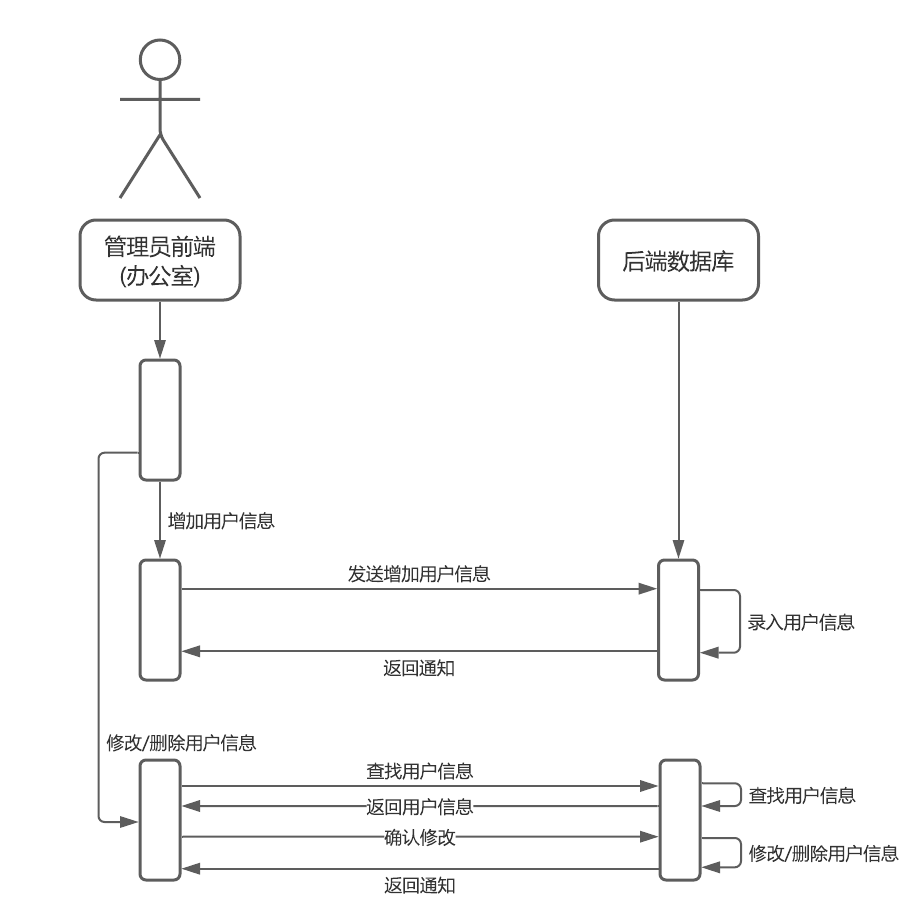

# 2021.09.23 审计摘要
> 备注：初步方案确定

> 参会人员：全员

## 讨论记录
1. 确定系统总体架构，明确使用场景

2. 明确各人分工

    | 人员 | 分工 |
    | ---- | ---- |
    | 忻 | 前端方法实现 + 后端 Email 系统 |
    | 白 | 前端 UI |
    | 绍 | 后端 DB |
    | 高 | 协作后端 DB |
    | 轩 | 文档写作 |

3. 设计相关业务逻辑

    #### 前端系统
    - 用户端查询逻辑
    

    - 用户借阅逻辑
    

    - 管理员端逻辑
    
    
    

    #### 后端系统
    - 数据库
        1. 书籍数据库
        2. 用户数据库
        > 备注：数据库应当存储用户及书籍的借阅历史，并支持调节书籍的可否借阅状态

    - Email 系统
        1. 缺书登记
        2. 预约借书登记
        3. 向所有次日到期书籍借阅者发送提醒

4. 下次审计工程量确定
- 审计日期：2021-10-14
- DB 部分完成
- 前端用户 UI 完成
- 前端方法 + 扫描方法完成
- 前期文档完成